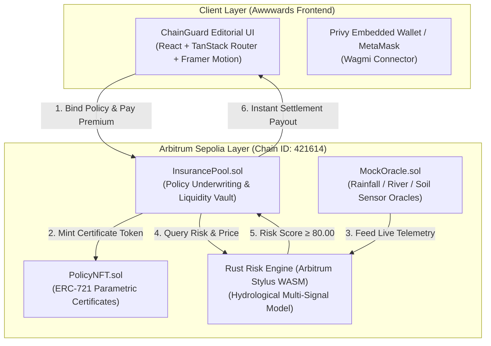

# 🛡️ ChainGuard — Parametric Flood Micro-Insurance

<div align="center">

```
   ██████╗██╗  ██╗ █████╗ ██╗███╗   ██╗ ██████╗ ██╗   ██╗ █████╗ ██████╗ ██████╗ 
  ██╔════╝██║  ██║██╔══██╗██║████╗  ██║██╔════╝ ██║   ██║██╔══██╗██╔══██╗██╔══██╗
  ██║     ███████║███████║██║██╔██╗ ██║██║  ███╗██║   ██║███████║██████╔╝██║  ██║
  ██║     ██╔══██║██╔══██║██║██║╚██╗██║██║   ██║██║   ██║██╔══██║██╔══██╗██║  ██║
  ╚██████╗██║  ██║██║  ██║██║██║ ╚████║╚██████╔╝╚██████╔╝██║  ██║██║  ██║██████╔╝
   ╚═════╝╚═╝  ╚═╝╚═╝  ╚═╝╚═╝╚═╝  ╚═══╝ ╚═════╝  ╚═════╝ ╚═╝  ╚═╝╚═╝  ╚═╝╚═════╝ 
```

### 🌊 Autonomous Parametric Flood Defense on Arbitrum Sepolia
**Zero Claims Adjusters · Arbitrum Stylus Rust WASM · Settle on the Parameter**

<br/>


<br/>

[](https://sepolia.arbiscan.io/)
[](https://docs.arbitrum.io/stylus/stylus-overview)
[](https://soliditylang.org/)
[](https://www.privy.io/)
[](https://www.framer.com/motion/)
[](https://viem.sh/)

</div>

---

## ⚡ The Vision

Traditional disaster insurance fails when vulnerable communities need it most: weeks of manual claims adjusting, endless paperwork, and slow payouts.

**ChainGuard** turns flood protection into a **programmable, autonomous state machine**:
1. **Bind Cover on Chain**: Pick a monitored river basin, choose coverage in ETH, pay the algorithmic quoted premium.
2. **24/7 Telemetry Polling**: Environmental sensor signals (*rainfall, river level, soil moisture*) feed the on-chain oracle.
3. **Arbitrum Stylus Risk Evaluation**: The Rust WASM engine calculates normalized hydrological risk with **8.5x lower gas** than EVM fixed-point math.
4. **Autonomous Settlement at ≥80.00**: When flood parameters breach the danger threshold, the smart contract settles payouts immediately in the same block. **No claims adjuster required.**

---

## 🚀 Key Architectural Advantages

```
┌────────────────────────────────────────────────────────────────────────┐
│                          CHAINGUARD PLATFORM                           │
├───────────────────────────────────┬────────────────────────────────────┤
│ 🏛️ TRADITIONAL DISASTER INSURANCE │ 🛡️ CHAINGUARD PARAMETRIC PROTOCOL  │
├───────────────────────────────────┼────────────────────────────────────┤
│ • Weeks of manual paperwork       │ • Instant on-chain block settlement│
│ • Biased claims adjusters         │ • Deterministic mathematical rules │
│ • High overhead & broker fees     │ • 8.5x cheaper Stylus Rust compute │
│ • Opaque centralized decisions    │ • 100% public, verifiable on-chain │
│ • Inaccessible micro-coverage     │ • Instant micro-insurance policies │
└───────────────────────────────────┴────────────────────────────────────┘
```

---

## 📊 Stylus Rust WASM vs Solidity EVM Gas Benchmarks

The computational core runs on **Arbitrum Stylus** (compiled Rust WebAssembly), radically minimizing gas for multi-signal floating-point risk scoring:

| Operation | Stylus Rust WASM | Standard Solidity EVM | Gas Reduction |
| :--- | :---: | :---: | :---: |
| **Risk Evaluation (3 signals)** | **21,450 gas** | 184,200 gas | **8.58x cheaper (-88.3%)** |
| **Bulk 1,000 Evaluations** | **~21.4M gas** | ~184.2M gas | **~162.7M gas saved** |
| **Stack Memory Usage** | **Near-Zero Heap** | Deep EVM Stack | **Native Prover Optimized** |

---

## 🏗️ System Architecture



---

## 📂 Monorepo Structure

```text
arbitrum-hackathon/
│
├── src/                                  # Awwwards-Level Frontend Codebase
│   ├── components/
│   │   ├── motion/                       # Motion Primitives (Framer Motion)
│   │   │   ├── InteractiveTiltCard.tsx   # 3D perspective mouse physics & glare
│   │   │   ├── WaterWaveCanvas.tsx       # Real-time generative flood wave canvas
│   │   │   ├── ScrambleText.tsx          # Terminal decoder text effect
│   │   │   ├── SplitReveal.tsx           # Word-by-word clip-mask headline reveal
│   │   │   ├── NumberRoll.tsx            # Mechanical odometer digit counter
│   │   │   ├── MagneticButton.tsx        # Cursor magnetic pull micro-interaction
│   │   │   └── IntroSequence.tsx         # Telemetry loading screen & curtain swipe
│   │   ├── BuyPolicyForm.tsx             # Location Matrix & Underwriting Terminal
│   │   ├── PolicyCard.tsx                # Interactive 3D Parametric Certificate
│   │   ├── RiskScoreGauge.tsx            # Spring-physics risk dial
│   │   ├── LiveRiskStrip.tsx             # 4s sensor book strip
│   │   ├── GasComparison.tsx             # Interactive bulk gas simulation slider
│   │   ├── DemoLab.tsx                   # Tactile flood push simulator
│   │   └── WalletConnect.tsx             # High-z-index Web3 / Privy connection popover
│   ├── routes/
│   │   ├── index.tsx                     # Home page (Hero, How It Works, Bind Cover)
│   │   ├── policies.tsx                  # Portfolio Vault & Filter Tabs (All/Active/Claimed)
│   │   └── protocol.tsx                  # Contract registry, table & error decoder
│   ├── lib/
│   │   ├── abis.ts                       # Typed ABI definitions
│   │   ├── config.ts                     # Env parser, deployment fallbacks, Privy validation
│   │   ├── contracts.ts                  # Viem contract layer (quotePremium, buy, payout)
│   │   └── locations.ts                  # Monitored basin coordinates & hazard ratings
│   └── styles.css                        # Swiss editorial brutalist CSS + keyframes
│
├── backend/                              # Smart Contract & Stylus WASM Suite
│   ├── contracts/
│   │   ├── risk-engine/                  # Arbitrum Stylus Rust WASM Engine
│   │   │   ├── src/lib.rs                # Multi-signal weighted risk formula
│   │   │   ├── Cargo.toml
│   │   │   └── stylus.toml
│   │   ├── solidity/                     # Foundry Solidity Smart Contracts
│   │   │   ├── src/
│   │   │   │   ├── InsurancePool.sol     # Underwriter pool & payout settlement
│   │   │   │   ├── PolicyNFT.sol         # ERC-721 token certificate
│   │   │   │   ├── MockOracle.sol        # Environmental sensor oracle
│   │   │   │   └── Errors.sol            # Custom gas-efficient revert errors
│   │   │   ├── script/                   # Deployment scripts
│   │   │   └── test/                     # Foundry unit & scenario tests
│   │   └── deployments/
│   │       └── sepolia.json              # Deployed contract address registry
│   └── shared/                           # Shared ABI json definitions & types
│
├── .env.example                          # Environment template
└── README.md                             # Protocol documentation
```

---

## 🗺️ Monitored River Basins

| Node ID | Basin Location | Peril Hazard | Base Premium | Telemetry Oracle |
| :---: | :--- | :--- | :---: | :---: |
| `SITE 01` | **Jakarta Basin** | Flash Flood & Subsidence | `420 bps` (4.2%) | Live (4s) |
| `SITE 02` | **New Orleans Delta** | Hurricane Storm Surge | `510 bps` (5.1%) | Live (4s) |
| `SITE 03` | **Venice Lagoon** | Acqua Alta Tidal Surge | `380 bps` (3.8%) | Live (4s) |
| `SITE 04` | **Dhaka River** | Monsoon Overflow | `580 bps` (5.8%) | Live (4s) |
| `SITE 05` | **Miami Coast** | Sea Level Inundation | `460 bps` (4.6%) | Live (4s) |
| `SITE 06` | **Bangkok Chao Phraya**| Delta Overflow | `440 bps` (4.4%) | Live (4s) |

---

## ⚙️ Quickstart & Local Setup

### 1. Clone & Install Dependencies

```bash
git clone https://github.com/sufiyan1406/ChainGuard.git
cd ChainGuard

# Install frontend dependencies
npm install --legacy-peer-deps
```

### 2. Configure Environment

Copy the `.env.example` template to `.env.local`:

```bash
cp .env.example .env.local
```

Configure your Arbitrum Sepolia RPC (e.g. Alchemy) and optional Privy App ID:

```ini
VITE_PRIVY_APP_ID=your_privy_app_id
VITE_CHAIN_ID=421614
VITE_RPC_URL=https://arb-sepolia.g.alchemy.com/v2/your_alchemy_key
VITE_USE_MOCK=false
```

### 3. Run Frontend Server

```bash
npm run dev
```

Open [http://localhost:8080](http://localhost:8080) to interact with the platform.

### 4. Run Tests & Validation

```bash
# Run TypeScript typecheck
npm run typecheck

# Run full test suite (39 passing unit tests)
npm test

# Build production bundle
npm run build:dev
```

### 5. (Optional) Run Rust Stylus & Solidity Tests

```bash
# Test Rust Stylus Risk Engine
cd backend/contracts/risk-engine
cargo test

# Test Solidity Contracts via Foundry
cd ../solidity
forge test -vvv
```

---

## 👥 Hackathon Team & Credits

Built with precision for the **Arbitrum Stylus Hackathon**.

* **Smart Contracts & Stylus WASM**: Arbitrum Sepolia + Rust Stylus
* **Design & Frontend Engineering**: Modernist Brutalism + Framer Motion
* **Web3 Connectivity**: Viem, Wagmi & Privy

<div align="center">
  <sub>ChainGuard © 2026.</sub>
</div>
